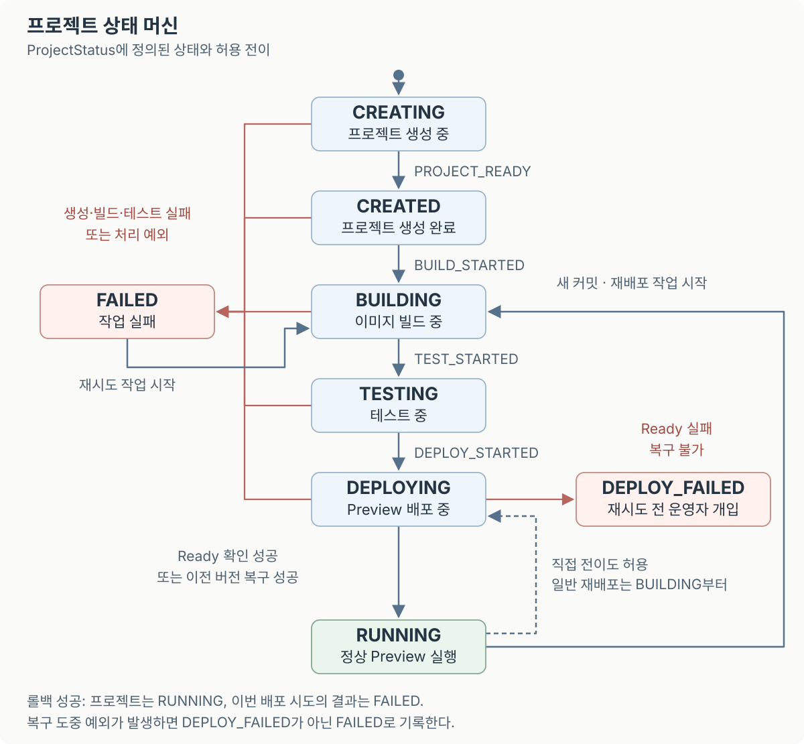

## 아이디어를 실행하기까지의 준비를 줄이고 싶었다

AI로 코드를 작성해도 저장소, 실행 환경, 테스트와 배포를 준비해야 한다. 이 반복 작업을 플랫폼이 맡으면 사용자는 아이디어 구현과 검증에 집중할 수 있다고 생각했다.

첫 단계로 개인 홈 서버에서 **GitHub 저장소 생성부터 미리보기 환경인 Preview 배포까지** 연결했다. 준비 시간이 얼마나 줄어드는지는 실제 사용으로 확인하려 한다.

## 프로젝트 생성부터 첫 실행까지

<video controls playsinline preload="metadata" aria-label="GitHub 로그인부터 프로젝트 생성, 배포 진행 상황 확인, Preview 접속까지의 MVP 플랫폼 사용 과정">
  <source src="/media/hello-mvp-sandbox/mvp-demo.mp4" type="video/mp4" />
  <a href="/media/hello-mvp-sandbox/mvp-demo.mp4">MVP 플랫폼 시연 영상 열기</a>
</video>

### 1. GitHub으로 로그인하고 프로젝트를 만든다

- GitHub으로 로그인해 접근 권한이 있는 프로젝트를 확인한다. 상세 화면에서도 저장소 권한을 다시 확인한다.
- 프로젝트 이름을 입력하면 템플릿으로 비공개 저장소를 만든다. FastAPI 코드, 테스트, Dockerfile이 기본으로 들어 있다.
- 목록에서 프로젝트 상태와 저장소·Preview 주소를 확인한다. `PROJECT_READY`는 프로젝트 생성 완료이며, 서비스 접속은 첫 배포 이후 가능하다.

### 2. 프로젝트 상세에서 배포 과정을 확인한다

- **Recent deployments:** 배포 대상 커밋과 생성 시각.
- **Recent events:** 이벤트 발생 시각·종류·심각도·메시지. 진행 상황과 실패 단계의 요약을 확인한다.

API, 변경 감지기, 워커가 남기는 주요 이벤트는 다음과 같다.

| 구분           | 주요 이벤트                                         | 의미                              |
| -------------- | --------------------------------------------------- | --------------------------------- |
| 생성           | `REPOSITORY_CREATED` · `PROJECT_READY`              | 저장소 생성 · 프로젝트 준비 완료  |
| 변경 감지      | `WEBHOOK_RECEIVED` · `COMMIT_OBSERVED`              | Webhook 수신 · Poller의 커밋 관측 |
| 작업 대기·시작 | `DEPLOYMENT_QUEUED` · `WORK_ITEM_CLAIMED`           | 큐 등록 · 워커의 처리 권한 획득   |
| 실행           | `BUILD_STARTED` · `TEST_STARTED` · `DEPLOY_STARTED` | 빌드 · 테스트 · 배포 시작         |
| 성공           | `PREVIEW_READY` · `DEPLOYMENT_SUCCEEDED`            | 실행 준비 확인 · 배포 완료        |
| 실패           | `BUILD_FAILED` · `TEST_FAILED` · `DEPLOY_FAILED`    | 실패 단계와 요약 기록             |
| 복구           | `ROLLBACK_SUCCEEDED` · `ROLLBACK_FAILED`            | 이전 버전 복구 결과               |

변경 감지만으로 배포가 등록된 것은 아니다. 큐 등록과 워커 시작 이벤트를 구분해 확인한다. Webhook과 Poller가 별도로 동작하므로 이벤트 순서도 항상 같지는 않다.

**이벤트는 처리 이력, `ProjectStatus`는 현재 상태**를 나타낸다.

- **롤백 성공:** 프로젝트는 `RUNNING`, 이번 배포 시도는 `FAILED`. 상태와 이벤트를 함께 확인한다.
- **복구 불가:** `DEPLOY_FAILED`로 기록하며 재시도 전 운영자 개입이 필요하다. 복구 중 예외는 `FAILED`로 기록한다.

### 3. Preview에서 응답을 확인한다

- 플랫폼이 Ready 엔드포인트로 실행 준비 상태를 확인한다.
- 사용자는 Preview 주소를 열어 FastAPI의 JSON 응답과 기능 동작을 확인한다.

## 코드 변경을 같은 Preview에 반영하기

개발자나 AI 에이전트가 `main`에 push하면 다음 순서로 처리한다.

1. **변경 감지:** Webhook 서명과 관리 대상 저장소의 `main` 변경인지 확인한다. Poller는 주기적으로 누락된 변경을 찾는다.
2. **작업 등록:** 프로젝트와 커밋 SHA를 PostgreSQL 큐에 저장한다. 같은 프로젝트·SHA의 배포는 중복 등록하지 않는다.
3. **빌드·테스트:** 지정된 SHA를 가져와 Docker 이미지를 빌드하고, 그 이미지의 임시 컨테이너에서 pytest를 실행한다.
4. **배포:** 테스트한 이미지로 Preview를 교체하고 Ready를 확인한다. 접속 주소는 유지한다.

FastAPI부터 지원해 실행·테스트·준비 확인 방법을 통일했다. 플랫폼 내 자연어 코드 생성은 현재 범위에 포함하지 않았다.

## 한 서버에서 실행 단위를 나누기

플랫폼 서비스는 Compose로 실행하고, 프로젝트별 Preview는 워커가 별도로 생성한다.

| 구성 요소               | 역할                                       |
| ----------------------- | ------------------------------------------ |
| 포털 · 제어 API         | 로그인·화면 제공 / 프로젝트 생성·이력 관리 |
| Webhook 수신기 · Poller | 변경 알림 처리 / 누락된 변경 조회          |
| 워커                    | 빌드·테스트·배포·복구                      |
| PostgreSQL              | 상태·이벤트·작업 큐 보존                   |
| 프로젝트별 Preview      | FastAPI 애플리케이션 실행                  |

- **접속:** Nginx Proxy Manager가 HTTPS와 호스트별 라우팅을 맡는다.
- **실행 권한:** 플랫폼 구성 요소 중 워커에만 Docker 소켓을 연결한다.
- **작업 보존:** 워커가 중단돼도 대기 작업은 DB에 남는다. 처리 권한은 heartbeat로 갱신하고 완료 시에도 검증한다.
- **장애 범위:** 한 서버와 Docker 데몬을 공유하므로 호스트 장애는 전체에 영향을 준다.

## 실패한 배포에서 복구하기

- **빌드·테스트 실패:** 실패 이력을 남기고 기존 정상 Preview를 유지한다.
- **교체·Ready 확인 실패:** 이전 이미지·데이터 볼륨·라우트로 복구를 시도한다.
- **워커 중단:** 시작 시점과 작업이 없을 때 복구를 점검해 중단된 배포를 정리한다.

앱의 `/data`는 별도 볼륨에 보존한다. 재배포 시 기존 Preview를 멈추고 이전 볼륨을 읽기 전용으로 연결해 새 볼륨으로 복제한다. 실패하면 변경 전 데이터로 돌아갈 수 있지만, 교체 중 중단과 복구 실패는 가능하다. 서버 장애에 대비한 자동 백업·복원은 후속 과제다.

## 배운 점과 다음 검증

- **배운 점:** 자동 배포에는 실행 조건과 실패 시 복구 기준이 함께 필요하다.
- **다음 검증:** 첫 Preview까지 걸리는 시간, 운영자 개입 횟수, 사용자의 수정·재배포 활용도.
- **후속 범위:** PR별 Preview, 운영 승격, 다른 런타임, 사내 보안 기준 적용.
